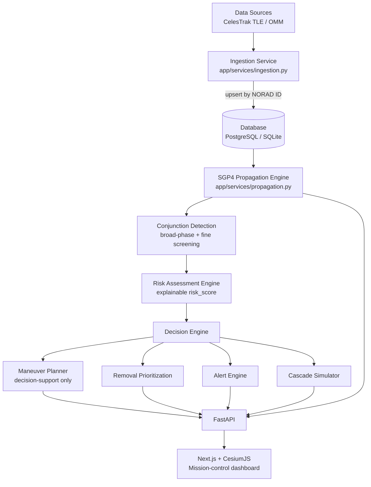
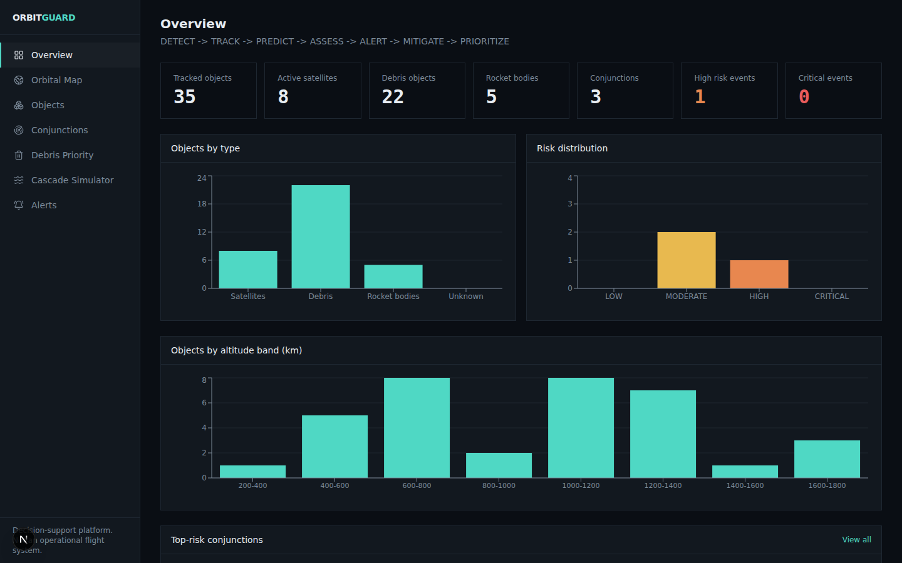
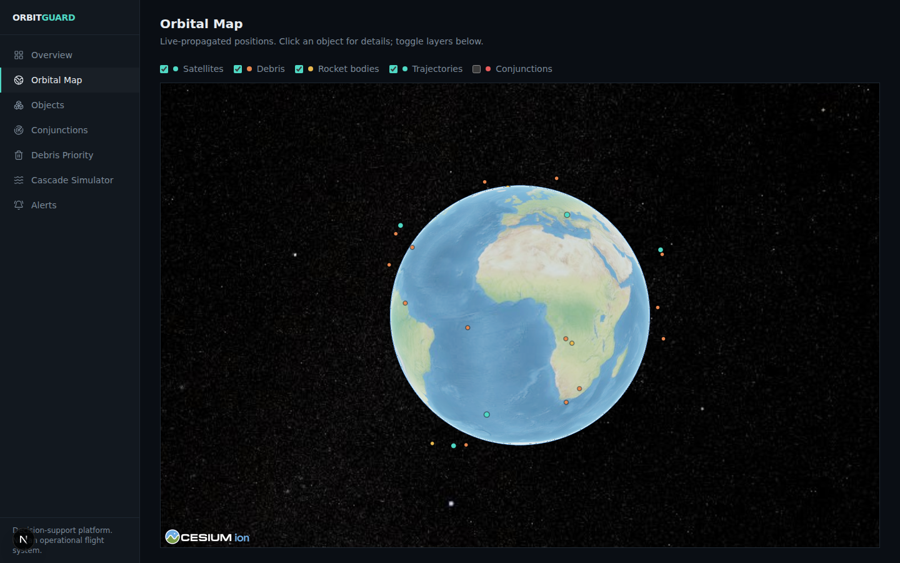
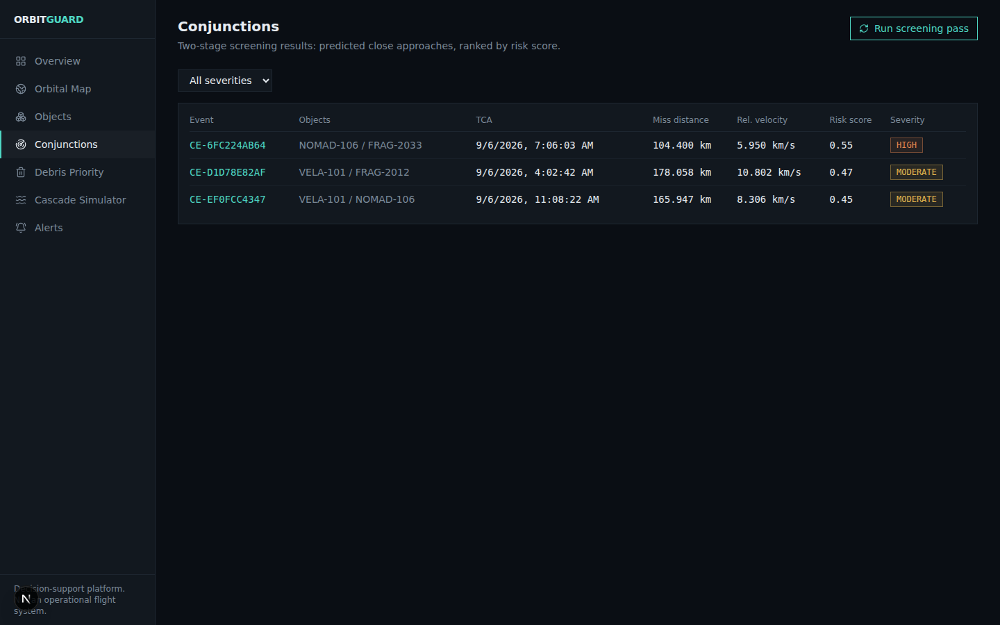
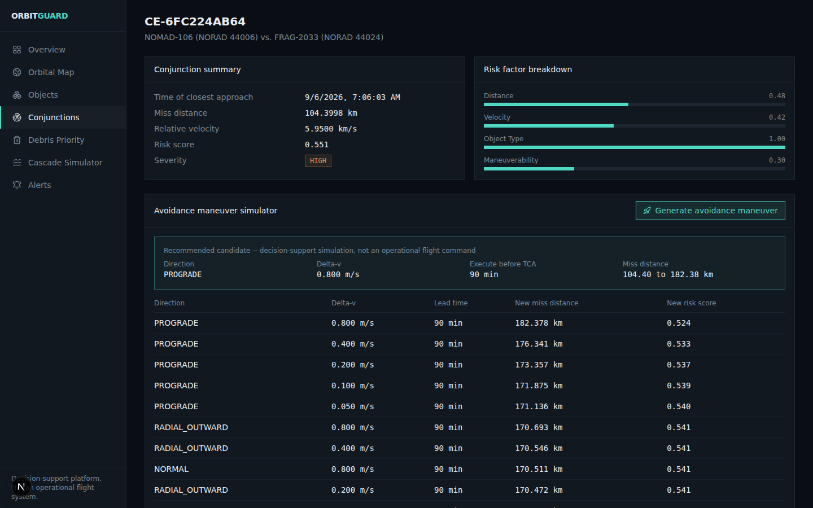
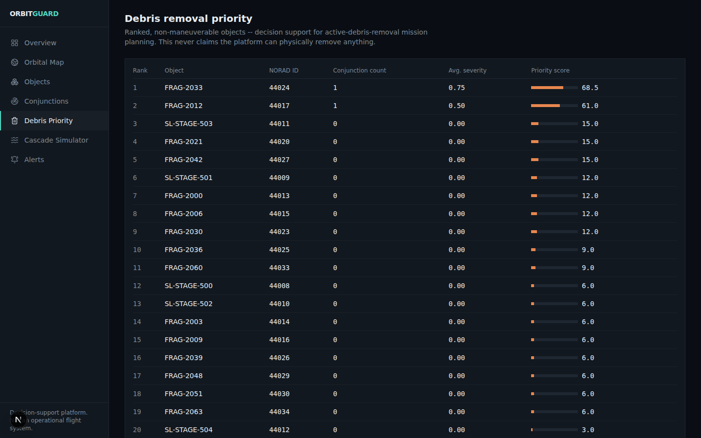
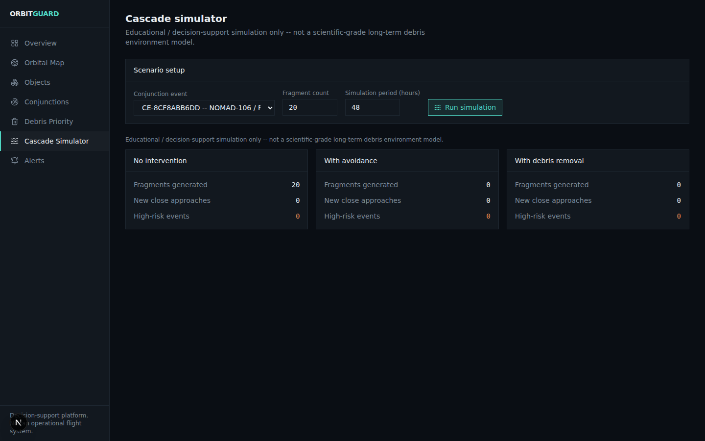

# ORBITGUARD

**AI-Assisted Space Debris Monitoring, Collision Prediction and Mitigation Decision-Support Platform**

> DETECT → TRACK → PREDICT → ASSESS → ALERT → MITIGATE → PRIORITIZE

ORBITGUARD is an integrated Space Situational Awareness (SSA) and Space
Traffic Management decision-support platform. It turns orbital tracking
data into actionable collision-risk intelligence: it does not claim to
physically remove debris or issue flight commands -- it recommends removal
priorities, simulates mitigation options, and supports satellite
collision-avoidance decisions made by human operators.

This repository began as `debris-tracker-API`, a FastAPI service with a
synthetic catalog, SGP4 propagation, and pairwise conjunction screening.
ORBITGUARD builds on that foundation rather than replacing it: the original
propagation approach, API-key auth, and rate limiting are all still in use.

---

## Problem statement

Low Earth Orbit is increasingly congested with active satellites, spent
rocket bodies, and fragmentation debris. Operators need to know, with
enough lead time to act: *which of my assets are at risk, how much, and
what can I do about it* -- and mission planners need a defensible way to
prioritize which derelict objects are worth removing first.

## Solution

ORBITGUARD ingests real orbital element data, persists it, propagates it
with SGP4, screens for close approaches with a two-stage detection engine,
scores each event with an explainable risk model, and -- where a satellite
involved can maneuver -- simulates candidate avoidance burns. Debris that
can't maneuver is instead ranked for removal priority. A Kessler-cascade
simulator makes the *cost of inaction* visible for a given conjunction.

## Architecture



## Features

| Area | What it does |
|---|---|
| Ingestion | Real CelesTrak TLE fetch, parsing, validation, dedup by NORAD ID, synthetic fallback for offline demos |
| Propagation | SGP4 via `python-sgp4`, single-state / trajectory / batch modes, in-process caching, lat/lon/altitude |
| Conjunction detection | Two-stage: altitude+plane broad-phase filter, then fine screening with TCA refinement |
| Risk engine | Normalized `risk_score` (0-1) with a per-factor explanation -- never mislabeled as a certified Pc |
| Maneuver planner | Tests 6 burn directions x multiple delta-v magnitudes with a two-body what-if propagator; decision-support only |
| Removal prioritization | Ranks non-maneuverable objects by conjunction frequency, severity, congestion, and size |
| Cascade simulator | Educational what-if: no-intervention vs. avoidance vs. removal, for a selected conjunction |
| Alerts | Auto-generated for HIGH/CRITICAL events or sub-threshold miss distance; NEW to ACKNOWLEDGED to RESOLVED |
| Security | API-key auth (constant-time compare), per-route rate limiting, configurable CORS |
| Background jobs | APScheduler jobs for ingestion refresh and periodic re-screening (off by default) |

## Tech stack

- **Backend**: FastAPI, SQLAlchemy 2.x, Alembic, `python-sgp4`, slowapi, APScheduler
- **Database**: PostgreSQL (production) / SQLite (local dev, zero setup)
- **Frontend**: Next.js (App Router), TypeScript, Tailwind CSS v4, CesiumJS, Recharts
- **Tests**: pytest (backend)
- **Containerization**: Docker, docker-compose

## Installation

### Local (SQLite, fastest path)

```bash
pip install -r requirements.txt
cp .env.example .env   # edit as needed
export DEBRIS_TRACKER_API_KEYS="your-key-here"
alembic upgrade head
uvicorn app.main:app --reload
```

Without `DEBRIS_TRACKER_API_KEYS` set, the service generates a dev key and
prints it once at startup -- it never silently runs unauthenticated.

On first boot with an empty catalog, ORBITGUARD automatically ingests data
(CelesTrak if reachable, otherwise the synthetic fallback catalog).
Interactive API docs are at `/docs`.

### Docker (Postgres)

```bash
cp .env.example .env
docker compose up --build
```

This starts Postgres, the backend, and the frontend together; the backend
runs Alembic migrations automatically on boot. Frontend at `http://localhost:3000`,
API at `http://localhost:8000`.

### Frontend (Next.js + CesiumJS)

```bash
cd frontend
npm install                # postinstall copies Cesium's static assets into public/cesium
cp .env.example .env.local # set NEXT_PUBLIC_API_BASE_URL / NEXT_PUBLIC_API_KEY
npm run dev
```

Nine pages: Overview, 3D Orbital Map, Objects, Conjunctions, Conjunction
Detail (with the avoidance maneuver simulator embedded), Debris Removal
Priority, Cascade Simulator, and Alerts. The 3D map uses Cesium's bundled
Natural Earth II imagery by default (no token, no network call needed) --
set `NEXT_PUBLIC_CESIUM_ION_TOKEN` for Ion's higher-resolution imagery/terrain
instead.

## Environment variables

See [`.env.example`](.env.example) for the full list with defaults --
covers auth, database URL, CORS origins, ingestion source/timeout,
screening defaults, alert thresholds, and background job intervals. Nothing
is hardcoded; every value is overridable via environment variable.

## API endpoints

| Method | Path | Notes |
|---|---|---|
| GET | `/health` | liveness + object count |
| GET | `/objects` | filter by type, maneuverability, altitude range, name, NORAD ID; paginated |
| GET | `/objects/{norad_id}` | single object |
| GET | `/objects/{norad_id}/state?at=<iso8601>` | propagated position/velocity + geodetic |
| GET | `/objects/{norad_id}/trajectory` | timestamped ECI trajectory over a duration |
| POST | `/ingestion/refresh` | force a re-ingestion pass |
| POST | `/conjunctions/screen` | run a fresh two-stage screening pass |
| GET | `/conjunctions` | list persisted events, filter by severity/NORAD ID; paginated |
| GET | `/conjunctions/{event_id}` | single event detail |
| POST | `/conjunctions/{event_id}/maneuver` | generate ranked avoidance-maneuver candidates |
| GET | `/debris/priorities` | ranked removal-priority list with explanations |
| POST | `/cascade/simulate` | Kessler-cascade what-if for a selected conjunction |
| GET | `/alerts` | list alerts, filter by status; paginated |
| PATCH | `/alerts/{alert_id}/acknowledge` | mark an alert acknowledged |

All endpoints except `/health` require the `X-API-Key` header.

## Screenshots

**Overview dashboard** -- live analytics from the running catalog and screening pass:



**3D orbital map** -- real SGP4-propagated positions rendered on Cesium's bundled basemap, colored by object type:



**Conjunctions** -- two-stage screening results, ranked by risk score:



**Avoidance maneuver simulator** -- ranked candidate burns for a real screened conjunction:



**Debris removal priority** -- ranked, explainable removal targets:



**Cascade simulator** -- no-intervention vs. avoidance vs. removal comparison:



## Demo workflow

1. `POST /ingestion/refresh` -- pull the latest catalog (or confirm the synthetic fallback is loaded)
2. `POST /conjunctions/screen` -- run a screening pass over the next 24h
3. `GET /conjunctions?severity=CRITICAL` -- pull the top-risk events
4. `POST /conjunctions/{event_id}/maneuver` -- generate avoidance candidates for a maneuverable satellite
5. `GET /debris/priorities` -- see which non-maneuverable objects are the highest-value removal targets
6. `POST /cascade/simulate` -- show the no-intervention vs. avoidance vs. removal comparison for the same event
7. `GET /alerts` -- review what got auto-flagged along the way

## Technical limitations

- **`risk_score` is an explainable heuristic, not a certified probability of
  collision.** A real Pc computation (e.g. Foster's method) needs the
  covariance of each object's orbit determination, which public TLE data
  does not carry.
- **The maneuver planner uses a short-horizon two-body propagator** for the
  post-burn trajectory (SGP4 has no native "add this delta-v" operation).
  This ignores drag/J2 over the short window to TCA, which is a reasonable
  approximation for decision support but not flight-grade precision.
- **The cascade simulator is educational**, not a scientific-grade
  long-term debris-environment model (compare to NASA LEGEND / ESA MASTER).
- **CelesTrak ingestion depends on outbound network access** to
  `celestrak.org`; if blocked, ingestion automatically and explicitly falls
  back to the synthetic catalog (tagged `data_source=SYNTHETIC_FALLBACK`
  in the ingestion response) rather than failing the whole pipeline.
- **The current screening broad-phase filter is bucket-based**, not a true
  spatial octree; sufficient for hundreds to low thousands of objects, but
  a production-scale catalog (tens of thousands) would need real spatial
  indexing.
- **Background jobs run in-process (APScheduler)**, fine for a single API
  instance; a multi-worker production deployment should move to a
  Celery/Redis architecture instead.

## Roadmap

- [x] Next.js + TypeScript + CesiumJS mission-control dashboard (9 pages)
- [ ] Frontend automated tests (backend has 32 pytest tests; frontend has none yet)
- [ ] WGS84 ellipsoidal geodetic conversion (currently spherical approximation)
- [ ] Real spatial-index broad-phase (octree/grid) for catalog sizes beyond a few thousand objects
- [ ] Covariance-based Pc computation when/if orbit-determination covariance data is available
- [ ] Celery/Redis background-job architecture for multi-worker deployments
- [ ] Conjunction/trajectory polylines on the 3D map use raw ECI coordinates as a short-window visual approximation (not corrected for Earth rotation) -- fine for the current short trail length, would need an ECI->ECEF rotation for longer trails

## Development

```bash
pip install -r requirements.txt
pytest                      # unit + API tests
alembic revision --autogenerate -m "describe change"   # after model changes
alembic upgrade head
```

## License

Hackathon/SIH demo project. Add a license before any production or public
deployment.
